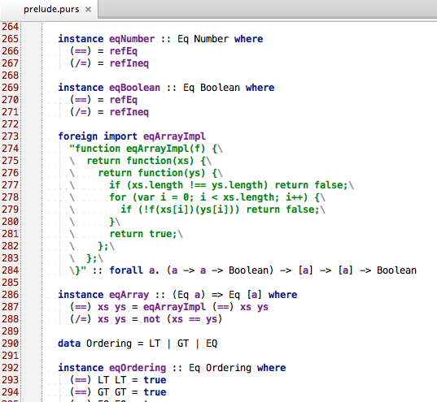
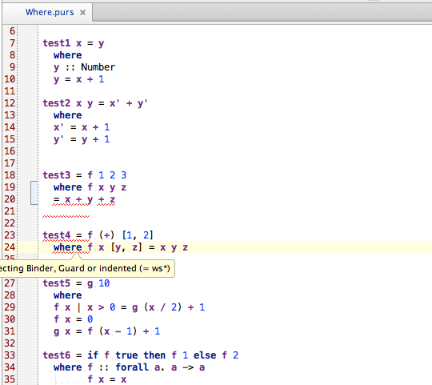

Pure IDEA
=========
An IntelliJ IDEA plugin for PureScript.

Introduction
------------

Pure IDEA is an IntelliJ IDEA plugin for [PureScript](https://github.com/purescript/purescript) language.
Currently, it is a working in progress and does not support too many functions. We just reached the point where
we can:

1. Syntax highlighting. We wrote a minimum parser combinator library in Java and it can recover from syntax error 
and continue parsing in some cases.
1. Grammar checking.

and that's it... :( We planned to make it much better than this. These will be supported pretty soon:

1. A build script, probably maven or ant (I know...).
1. A file type icon.
1. Robust parsing.
1. JavaScript language injection (meaning when you have a foreign import with raw JavaScript as a string literal,
it will utilize the IDE's JavaScript functions for syntax highlighting and grammar checking).
1. PureScript SDK and compiling/running through `psc`.
1. Code folding.
1. Commenting/Uncommenting.
1. Navigation through symbols.
1. Code completion.

In a longer term, we will seek to support:

1. Indexing and exporting/importing symbols from/to other JavaScript files in your project.
1. Refactoring across the project.
1. Linting (we will need a pslint of some sort).
1. Formatting (only if the layout becomes extremely solid).

Snapshots
---------
Parsing prelude.purs:

Parsing edited examples/passing/Where.purs and introducing an error.

Contributing
------------

1. To add a new feature or to fix a bug, add a test case.
2. Please use Pull Requests.
3. Feel free to create new issues.

Hacking
-------
For now, simply load the project in IntelliJ 14. Possibly changing the SDK of the project. A more specific building
instruction will be given soon.

Author(s)
---------
* [Bei Zhang (ikarienator@gmail.com)](https://github.com/ikarienator)

License (BSD)
-------------

Copyright (c) 2014, Pure IDEA contributors
All rights reserved.

Redistribution and use in source and binary forms, with or without modification, are permitted provided that the
following conditions are met:

1. Redistributions of source code must retain the above copyright notice, this list of conditions and the following
disclaimer.

2. Redistributions in binary form must reproduce the above copyright notice, this list of conditions and the
following disclaimer in the documentation and/or other materials provided with the distribution.

3. Neither the name of the copyright holder nor the names of its contributors may be used to endorse or promote
products derived from this software without specific prior written permission.

THIS SOFTWARE IS PROVIDED BY THE COPYRIGHT HOLDERS AND CONTRIBUTORS "AS IS" AND ANY EXPRESS OR IMPLIED WARRANTIES
INCLUDING, BUT NOT LIMITED TO, THE IMPLIED WARRANTIES OF MERCHANTABILITY AND FITNESS FOR A PARTICULAR PURPOSE ARE
DISCLAIMED. IN NO EVENT SHALL THE COPYRIGHT HOLDER OR CONTRIBUTORS BE LIABLE FOR ANY DIRECT, INDIRECT, INCIDENTAL,
SPECIAL, EXEMPLARY, OR CONSEQUENTIAL DAMAGES (INCLUDING, BUT NOT LIMITED TO, PROCUREMENT OF SUBSTITUTE GOODS OR
SERVICES; LOSS OF USE, DATA, OR PROFITS; OR BUSINESS INTERRUPTION) HOWEVER CAUSED AND ON ANY THEORY OF LIABILITY,
WHETHER IN CONTRACT, STRICT LIABILITY, OR TORT (INCLUDING NEGLIGENCE OR OTHERWISE) ARISING IN ANY WAY OUT OF THE
USE OF THIS SOFTWARE, EVEN IF ADVISED OF THE POSSIBILITY OF SUCH DAMAGE.
